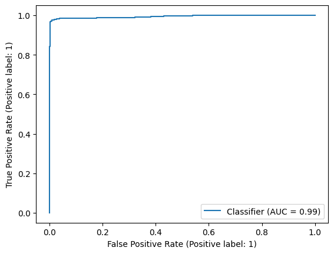
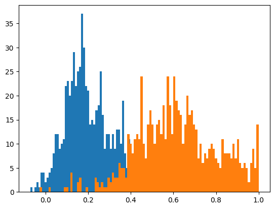
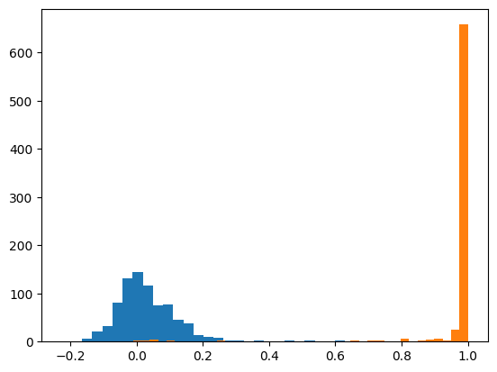
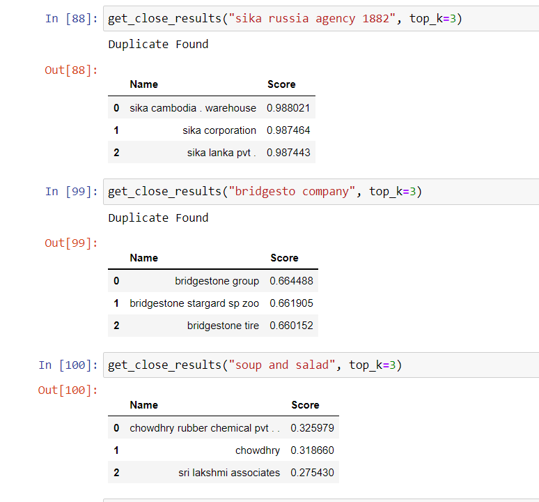

<h1>Company name duplicates finder</h1>

<h3>Data</h3>
<ul>
  <li>Train: 7k samples</li>
  <li>Val: 3k samples</li>
</ul>

<h3> Preprocessing </h3>
<ul>
  <li>To lower case</li>
  <li>Transliteration</li>
  <li>Signs deleting</li>
  <li>Stop words deleting</li>
  <li>General cleaning</li>
</ul>

<h3> ARCH Experiments </h3>
<ul> <b> SentenceBert </b>
  <li>all-mpnet-base-v2</li>
  <li>all-MiniLM-L6-v2</li>
  <li>paraphrase-albert-small-v2</li>
</ul>

<h4>Best model by tradeOff metrics | inference speed | Mem Usage - all-MiniLM-L6-v2 </h4>

<h3> Metrics </h3>
<ul> <b> all-MiniLM-L6-v2 </b>
  <li>Recall: 0.99</li>
  <li>Precicison: 0.99</li>
  <li>F1: 0.99</li>
  <li>RocAuc Score: 0.99 
  
  </li>
</ul>

<h3> Algorithm explanation</h3>
1.Get pretrained model -> 2.Fineture the model 
 
<b>Prediction destribution before training</b> 
 
<b>Prediction destribution after training</b> 
 
  
<b>Ranged existing names from DB based on the input</b> 

<h3> Requirements & Сharacteristic </h3>
<ul> <b> all-MiniLM-L6-v2 </b>
  <li>GPU: 1GB</li>
  <li>Inference speed: 14000 Sentences/Sec on V100 GPU</li>
</ul>
<h3> Code & Data </h3>
<ul> <b> bert based </b>
  <li>Code is stored in notebooks/*</li>
  <li>Splits are located in data/* </li>
</ul>

